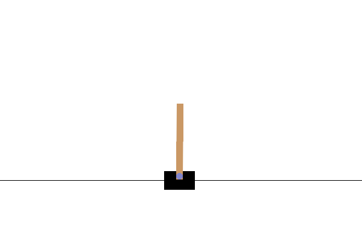

### Important Note:
*This repository builds on code from earlier on in my learning journey.
I am looking to explore more techniques in the future and will likely be creating a new repository for this purpose. 
That said, I will be lightly maintaining it, so feel free to contribute to it or raise issues.*

# Gym Projects:
## DQN Agents for Reinforcement Learning

[](https://github.com/psf/black)
[](https://www.python.org/downloads/release/python-380/)
[](https://pytorch.org/)
[](https://opensource.org/licenses/MIT)

[**Installation**](#installation) | [**Usage**](#usage) | [**Project Structure**](#project-structure) | [**License**](#license) | [**Contributing**](#contributing) | [**Acknowledgments**](#acknowledgments) | [**References**](#references)

This repository contains an implementation of a Deep Q-Network (DQN) agent for reinforcement learning tasks, specifically designed to interact with the classic control environments with discrete action spaces of OpenAI [Gym](https://github.com/openai/gym) environments. 
The agent is implemented in PyTorch and uses a simple feedforward network as the Q-function approximator. 
The agent is capable of training and evaluating its performance in a variety of environments.


## Installation

1. Clone the repository:

```bash
git clone https://github.com/Uokoroafor/gym_projects.git
```

2. Install the required dependencies:

```bash
cd gym_projects
pip install -r requirements.txt
```

## Usage

The repository provides examples of using the DQN agent to solve the [LunarLander](https://gymnasium.farama.org/environments/box2d/lunar_lander/) and [CartPole](https://gymnasium.farama.org/environments/classic_control/cart_pole/) environments. You can find the examples in the `examples/` folder.

### Training on LunarLander
This environment is a classical control environment. It is a rocket trajectory optimization problem. 
There are two environment versions: *discrete* or *continuous*. This implementation uses the discrete version.
The aim is to land the Lander on the landing pad, which is always at coordinates (0,0).

#### Action Space
There are four discrete actions available:

- 0: do nothing
- 1: fire left orientation engine
- 2: fire main engine
- 3: fire right orientation engine

#### Observation Space
The state is an 8-dimensional vector: 
- The coordinates of the lander in x & y
- Its linear velocities in x & y
- Its angle
- Its angular velocity
- Two booleans that represent whether each leg is in contact with the ground or not.

#### Rewards
An episode is considered a solution if it scores at least **200 points**.

#### Start State
The lander starts at the top center of the viewport with a random initial force applied to its center of mass.

#### Episode Termination
The episode finishes if:

- The lander crashes (the lander body gets in contact with the moon);

- The lander gets outside of the viewport (x coordinate is greater than 1);

- The lander is not [awake](https://box2d.org/documentation/md__d_1__git_hub_box2d_docs_dynamics.html#autotoc_md61)


To train the DQN agent on the  LunarLander environment, for example, run the following command:

```bash
python examples/lunar_agents.py
```

The agent is able to learn the environment going from a random policy to a policy that is able to land the Lander on the landing pad.

#### Random Policy
  

#### Trained Policy
  

### Training on CartPole
This is part of the Classic Control environments which corresponds to a version of the cart-pole problem. 
A pole is attached by an un-actuated joint to a cart, which moves along a frictionless track. The pendulum is placed 
upright on the cart and the goal is to balance the pole by applying forces in the left and right direction on the cart.

#### Action Space
There are two discrete actions available:
- 0: Push cart to the left
- 1: Push cart to the right

#### Observation Space
The state is an 4-dimensional vector: 
- The position of the cart (x coordinate - between -2.4 and 2.4)
- The velocity of the cart (between -inf and inf)
- The angle of the pole (between -0.418 and 0.418 radians)
- The angular velocity of the pole (between -inf and inf)

#### Rewards
An episode is considered a solution if it scores at least **200 points** for v0 and **500 points** for v1.

#### Start State
All observations are assigned a uniform random value between ±0.05.

#### Episode Termination
The episode finishes if:
- The absolute value of the pole angle is more than 0.2095 radians
- The absolute value of the cart position is more than 2.4 (center of the cart reaches the edge of the display)
- The episode length is greater than 200 for v0 and 500 for v1

```bash
python examples/cartpole_agents.py
```
The agent is able to learn the environment going from a random policy (left) to a policy that is able to balance the pole on the cart (right).

#### Random Policy


#### Trained Policy

<!--
<p align="center">
  
  
-->

### Evaluation
The DQNs in the training examples are trained for 1000 episodes and evaluated for 10 episodes. They produce the training and evaluation plots below:

#### Lunar Lander
<p align="center">
  
  

#### CartPole
<p align="center">
  
  

As denoted by the training curves, DQN training is unstable and often multiple runs are required to achieve good results. The evaluation curves show that the agent is able to learn the environment and achieve the desired score. A later repo will consider more sophisticated techniques.

## Project Structure

The repository has the following structure:

```
├── dqn.py                 # DQN model implementation
├── replaybuffer.py        # Replay buffer implementation
├── agent.py               # DQN agent implementation
├── examples/              # Example usage of the DQN agent
├── images/                # Directory for saving rendering images and GIFs
├── utils/                 # Utility functions
├── LICENSE                # License file
├── requirements.txt       # Requirements file
├── gym_environments.ipynb # Jupyter notebook with usage examples
└── README.md              # Project README file
```

## License

This project is licensed under the [MIT License](LICENSE).

## Contributing

Contributions to this repository are welcome. If you find any issues or have suggestions for improvements, please open an issue or a pull request.

## Acknowledgments

This project builds on a Reinforcement Learning coursework from Imperial College London and was also inspired by the Deep Q-Network algorithm and the OpenAI Gym environment.
I would also like to thank [Prof Aldo Faisal](https://www.imperial.ac.uk/people/a.faisal), [Dr Paul Bilokon](https://www.imperial.ac.uk/people/paul.bilokon01) and the rest of the teaching team for setting up the course and providing the resources for learning.

## References
1. **Playing Atari with Deep Reinforcement Learning** by Volodymyr Mnih et al. (2013):
   - [ArXiv Preprint](https://arxiv.org/abs/1312.5602)

2. **Human-level control through deep reinforcement learning** by Volodymyr Mnih et al. (2015):
   - [Nature Journal](https://www.nature.com/articles/nature14236)
   - [ArXiv Preprint](https://arxiv.org/abs/1509.06461)

- [OpenAI Gym.](https://gym.openai.com/)
